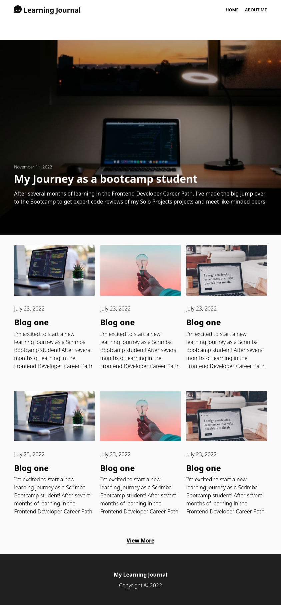

# Learning Journal
This repository contains the code for my solo project named "Learning Journal" which I completed during my Responsive Design course on Scrimba. The primary goal of this project was to enhance my understanding and skills in creating responsive design for the web using mobile-first approach.

The project aimed to build an application that allows users to record their learning journey and reflect on their learning experiences while being able to view the same on various devices. The secondary goal of this project is to apply what I learned in the responsive design course in practice and build a functional responsive web site.

Please feel free to explore the code and the functionality of the application. If you have any questions or feedback, feel free to reach out to me through Github.

checkout the live version: [learning-journal](https://raees-learning-journal.netlify.app/)

